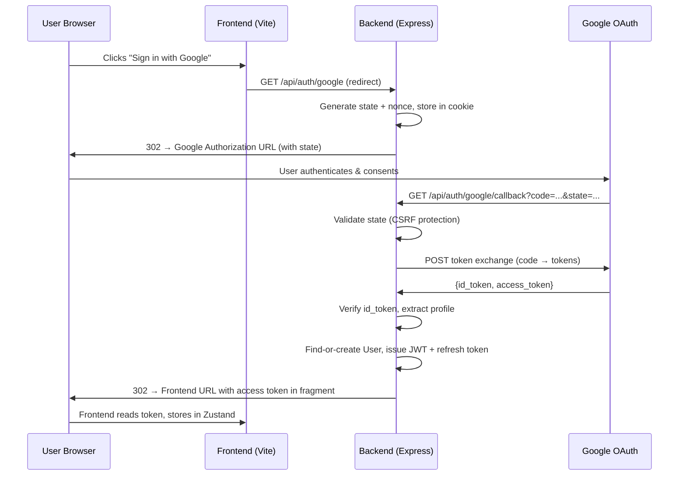

# Google OAuth Integration for Chatify

## Codebase Analysis Summary

### Current Architecture
| Layer | Technology | Details |
|-------|-----------|---------|
| **Backend** | Express 5 + MongoDB (Mongoose 9) | ESM modules, `nodemon` dev server |
| **Frontend** | React 19 + Vite 8 + TypeScript | Zustand stores, Tailwind CSS 4, shadcn/ui, react-router 7 |
| **Auth** | JWT access tokens + opaque refresh tokens | Access tokens (30m TTL) in memory/Zustand; refresh tokens (14d) in HttpOnly cookies + MongoDB `Session` model |
| **Realtime** | Socket.IO | Authenticates via access token in `socket.handshake.auth` |

### Key Files Read
- [authController.js](file:///c:/Users/phucn/OneDrive/Documents/mock-project/backend/src/controllers/authController.js) — `signUp`, `signIn`, `signOut`, `refreshToken`
- [User.js](file:///c:/Users/phucn/OneDrive/Documents/mock-project/backend/src/models/User.js) — `username`, `hashedPassword`, `email`, `displayName`, `avatarUrl`, `avatarId`, `bio`, `phoneNumber`
- [Session.js](file:///c:/Users/phucn/OneDrive/Documents/mock-project/backend/src/models/Session.js) — `userId`, `refreshToken`, `expiresAt` (TTL index)
- [authMiddleware.js](file:///c:/Users/phucn/OneDrive/Documents/mock-project/backend/src/middlewares/authMiddleware.js) — verifies JWT `Authorization: Bearer <token>`
- [authRoute.js](file:///c:/Users/phucn/OneDrive/Documents/mock-project/backend/src/routes/authRoute.js) — `/signup`, `/signin`, `/signout`, `/refresh`
- [server.js](file:///c:/Users/phucn/OneDrive/Documents/mock-project/backend/src/server.js) — CORS with `credentials: true`, `cookie-parser`
- [signin-form.tsx](file:///c:/Users/phucn/OneDrive/Documents/mock-project/frontend/src/components/auth/signin-form.tsx) — shadcn Card + react-hook-form + zod
- [signup-form.tsx](file:///c:/Users/phucn/OneDrive/Documents/mock-project/frontend/src/components/auth/signup-form.tsx) — same pattern
- [useAuthStore.ts](file:///c:/Users/phucn/OneDrive/Documents/mock-project/frontend/src/stores/useAuthStore.ts) — Zustand + persist, `signIn`/`signUp`/`signOut`/`refresh`/`fetchMe`
- [authService.ts](file:///c:/Users/phucn/OneDrive/Documents/mock-project/frontend/src/services/authService.ts) — API calls via axios instance
- [axios.ts](file:///c:/Users/phucn/OneDrive/Documents/mock-project/frontend/src/lib/axios.ts) — interceptor auto-refreshes on 403

### Key Constraints
- `User.hashedPassword` is **required** in the schema → must be made optional for Google OAuth users (they have no local password)
- `User.username` is **required + unique** → Google users need a generated username
- **No existing `.env` file found** in git — env vars are loaded via `dotenv`

---

## OAuth Flow Design

### Chosen Flow: **Authorization Code Flow (backend token exchange)**

This is the most secure approach for a separate backend/frontend architecture:



### Why This Flow?
1. **Client secret stays on the server** — never exposed to the browser
2. **State parameter** validates via HttpOnly cookie — prevents CSRF
3. **Token exchange** happens server-side — Google tokens are never sent to the frontend
4. **Same session mechanism** as existing auth — JWT access token + refresh token cookie

---

## User Review Required

> [!IMPORTANT]
> **User Model Schema Change**: `hashedPassword` must change from `required: true` to `required: false` so Google OAuth users (who have no password) can be stored. This is a minimal, backward-compatible change — existing users already have passwords, so nothing breaks.

> [!IMPORTANT]
> **New Environment Variables Required**: You'll need a Google Cloud Console project with OAuth 2.0 credentials. I'll document the exact setup steps.

> [!WARNING]
> **Username Generation for Google Users**: Google profiles don't include a "username." I'll auto-generate one from the email prefix (e.g., `john` from `john@gmail.com`) and append a random suffix if it already exists (e.g., `john_8f3a`). The user can change their username later if needed.

---

## Proposed Changes

### Backend — User Model

#### [MODIFY] [User.js](file:///c:/Users/phucn/OneDrive/Documents/mock-project/backend/src/models/User.js)
- Change `hashedPassword` from `required: true` to `required: false`
- Add new field `googleId: { type: String, unique: true, sparse: true }` to link Google accounts
- Add new field `authProvider: { type: String, enum: ["local", "google"], default: "local" }` to distinguish auth methods

---

### Backend — Google Auth Controller

#### [NEW] [googleAuthController.js](file:///c:/Users/phucn/OneDrive/Documents/mock-project/backend/src/controllers/googleAuthController.js)
- `googleLogin` — generates state token, stores in HttpOnly cookie, redirects to Google's authorization URL
- `googleCallback` — handles the callback from Google:
  1. Validates `state` parameter against cookie (CSRF protection)
  2. Exchanges authorization code for tokens via Google's token endpoint
  3. Verifies the `id_token` using `google-auth-library`
  4. Extracts user profile (email, name, avatar, Google sub ID)
  5. **Edge case: email already exists** → links the Google account to the existing user (sets `googleId`)
  6. **New user** → creates account with generated username, no password
  7. Issues JWT access token + refresh token (same as existing `signIn`)
  8. Redirects to frontend with access token in URL fragment

---

### Backend — Auth Route

#### [MODIFY] [authRoute.js](file:///c:/Users/phucn/OneDrive/Documents/mock-project/backend/src/routes/authRoute.js)
- Add `GET /google` → `googleLogin`
- Add `GET /google/callback` → `googleCallback`

---

### Backend — Dependencies

#### [MODIFY] [package.json](file:///c:/Users/phucn/OneDrive/Documents/mock-project/backend/package.json)
- Add `google-auth-library` — for securely verifying Google's ID tokens

---

### Frontend — Auth Service

#### [MODIFY] [authService.ts](file:///c:/Users/phucn/OneDrive/Documents/mock-project/frontend/src/services/authService.ts)
- Add `getGoogleAuthUrl()` — returns the backend Google auth URL
- No actual API call needed — it's a redirect

---

### Frontend — Auth Store

#### [MODIFY] [useAuthStore.ts](file:///c:/Users/phucn/OneDrive/Documents/mock-project/frontend/src/stores/useAuthStore.ts)
- Add `signInWithGoogle()` method that redirects to the backend Google auth endpoint
- Add `handleGoogleCallback(accessToken)` method to process the token from URL fragment after redirect

---

### Frontend — Auth Store Types

#### [MODIFY] [store.ts](file:///c:/Users/phucn/OneDrive/Documents/mock-project/frontend/src/types/store.ts)
- Add `signInWithGoogle: () => void` and `handleGoogleCallback: (token: string) => Promise<void>` to `AuthState`

---

### Frontend — Google OAuth Callback Page

#### [NEW] [GoogleCallbackPage.tsx](file:///c:/Users/phucn/OneDrive/Documents/mock-project/frontend/src/pages/GoogleCallbackPage.tsx)
- Reads the access token from the URL parameter
- Calls `handleGoogleCallback()` in the auth store
- Redirects to `/` on success, `/signin` on failure
- Shows a loading spinner during processing

---

### Frontend — Sign-In Form

#### [MODIFY] [signin-form.tsx](file:///c:/Users/phucn/OneDrive/Documents/mock-project/frontend/src/components/auth/signin-form.tsx)
- Add a "Sign in with Google" button with Google's brand icon below the existing sign-in button
- Add a visual divider ("or continue with")
- Button triggers `signInWithGoogle()` from the auth store

---

### Frontend — Sign-Up Form

#### [MODIFY] [signup-form.tsx](file:///c:/Users/phucn/OneDrive/Documents/mock-project/frontend/src/components/auth/signup-form.tsx)
- Add matching "Sign up with Google" button with divider (same style as sign-in)

---

### Frontend — App Router

#### [MODIFY] [App.tsx](file:///c:/Users/phucn/OneDrive/Documents/mock-project/frontend/src/App.tsx)
- Add route `/auth/google/callback` → `GoogleCallbackPage`

---

### Frontend — Axios Interceptor

#### [MODIFY] [axios.ts](file:///c:/Users/phucn/OneDrive/Documents/mock-project/frontend/src/lib/axios.ts)
- Add `/auth/google` to the list of URLs that skip token refresh retry logic

---

## Edge Cases Handled

| Scenario | Behavior |
|----------|----------|
| Google sign-in with existing email (local account) | Links Google ID to existing account, signs in normally |
| Google sign-in with already-linked account | Signs in directly |
| User cancels Google consent screen | Google redirects with `error=access_denied`, backend redirects to frontend `/signin?error=cancelled` |
| Expired/invalid Google tokens | Backend verifies ID token server-side; returns error if invalid |
| CSRF: forged callback | State parameter mismatch → 403 |
| Google account has no username | Auto-generates from email prefix + random suffix |

---

## Security Best Practices

1. **State parameter** — cryptographically random, stored as HttpOnly cookie, validated on callback
2. **Token exchange** — authorization code → tokens happens on backend, `client_secret` never exposed
3. **ID token verification** — uses `google-auth-library` to verify token signature and claims
4. **No Google tokens stored** — only the `googleId` (sub claim) is persisted; Google access/refresh tokens are discarded
5. **Same session security** — JWT + HttpOnly refresh cookie, identical to existing auth

---

## Environment Variables Required

Add these to your backend `.env` file:

```env
# Google OAuth 2.0 (from Google Cloud Console)
GOOGLE_CLIENT_ID=your-client-id.apps.googleusercontent.com
GOOGLE_CLIENT_SECRET=your-client-secret
GOOGLE_CALLBACK_URL=http://localhost:5001/api/auth/google/callback
```

Add this to your frontend `.env` file (already exists as `VITE_API_URL`):
```env
# No new frontend env vars needed — uses existing VITE_API_URL
```

---

## Google Cloud Console Setup Guide

1. Go to [Google Cloud Console](https://console.cloud.google.com/)
2. Create a new project or select an existing one
3. Navigate to **APIs & Services → Credentials**
4. Click **+ CREATE CREDENTIALS → OAuth client ID**
5. Select **Web application** as application type
6. Set **Authorized JavaScript origins**: `http://localhost:5173` (your Vite dev server)
7. Set **Authorized redirect URIs**: `http://localhost:5001/api/auth/google/callback`
8. Copy the **Client ID** and **Client Secret** to your `.env`
9. Under **OAuth consent screen**, configure:
   - App name: `Chatify`
   - User support email: your email
   - Scopes: `email`, `profile`, `openid`

---

## Verification Plan

### Automated Tests
- Start the backend server and verify `GET /api/auth/google` returns a 302 redirect to `accounts.google.com`
- Verify state parameter is set as a cookie in the redirect response
- Verify that a forged callback (wrong state) returns 403

### Manual Verification
1. Click "Sign in with Google" on the sign-in page
2. Complete Google authentication
3. Verify redirect back to the app with a valid session
4. Verify user profile is created/linked in MongoDB
5. Verify the same Google account can log in again (find existing user)
6. Verify a Google user with an existing email gets properly linked
7. Verify that existing username/password login still works unchanged

---

## Open Questions

> [!IMPORTANT]
> **Account Linking Policy**: When a Google sign-in email matches an existing local account's email, should we:
> - **(A) Automatically link** the Google ID to that account and sign in? (Recommended — better UX)
> - **(B) Reject** and ask the user to sign in with their password first, then link in settings?
> 
> I recommend **Option A** for simplicity. Please confirm.

> [!IMPORTANT]
> **Production Redirect URLs**: For now I'll configure everything for `localhost` development. When you deploy, you'll need to update `GOOGLE_CALLBACK_URL` and add your production domain to Google Cloud Console. Is that understood?
